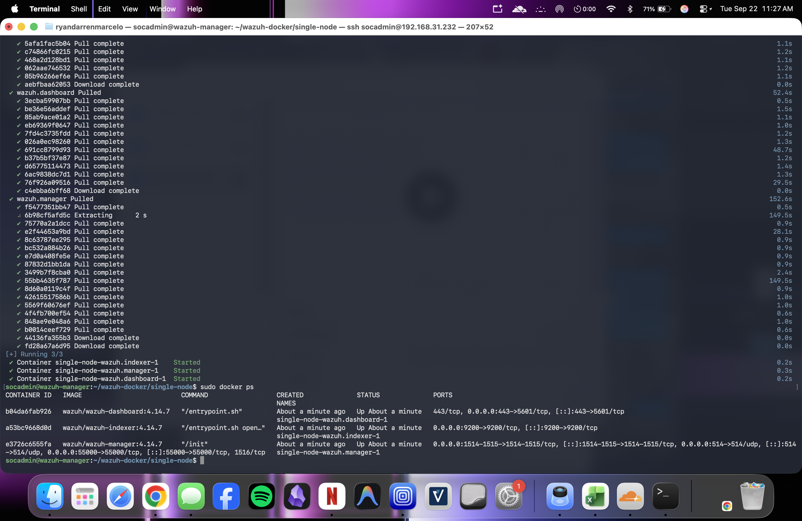
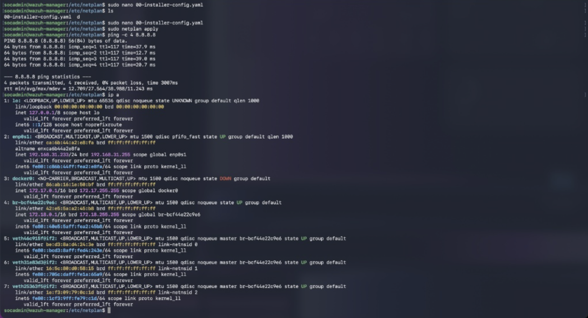
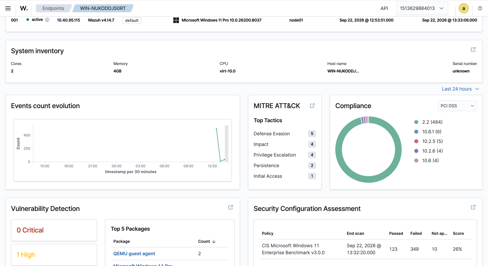
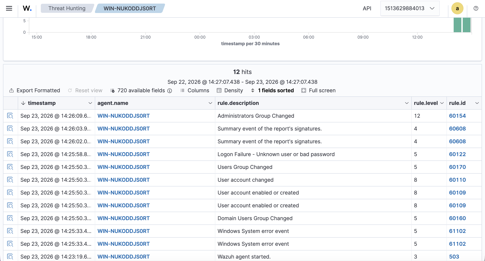
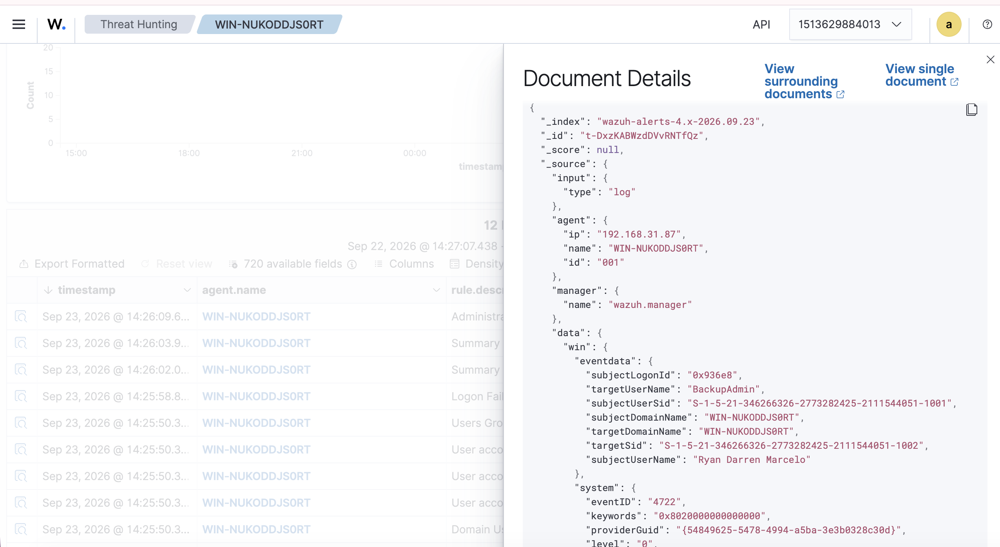
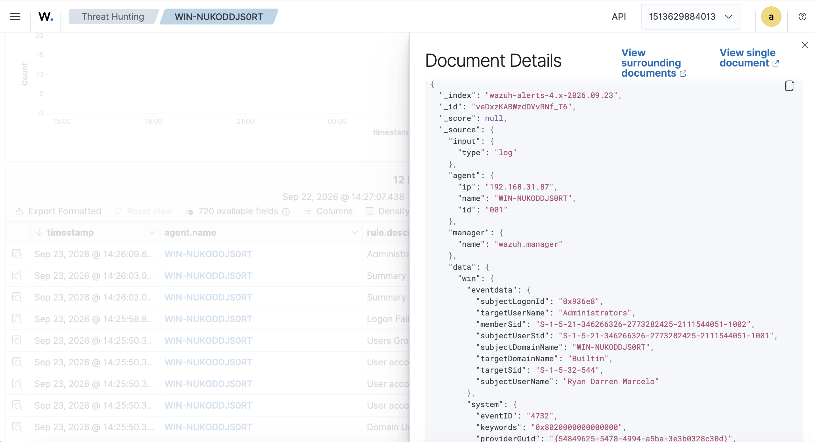
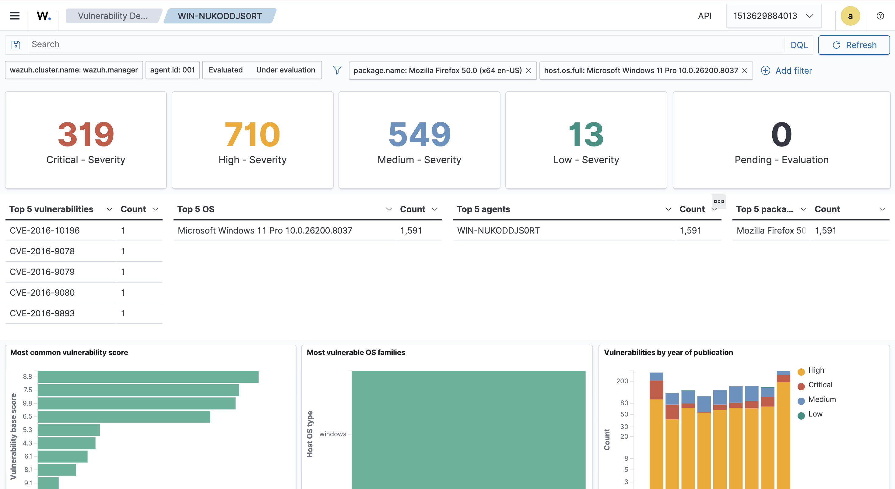
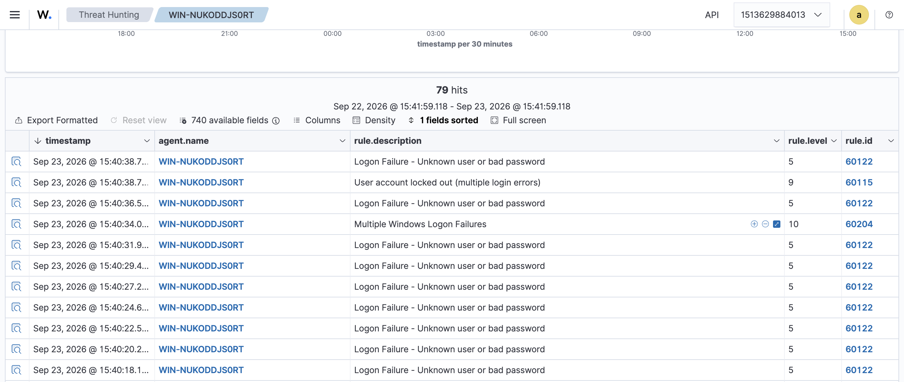

## Wazuh SIEM Home Lab Deployment

**Objective:** Engineered an enterprise-grade SIEM environment from scratch to detect, monitor, and analyze live security threats across a virtualized network.

### Phase 1: Infrastructure Provisioning
*   **Hypervisor:** UTM on Apple Silicon (ARM64)
*   **Server:** Ubuntu 24.04 LTS 
*   **Endpoint:** Windows 11 Pro 

### Phase 2: System Architecture & Troubleshooting
*   Deployed the native ARM64 Wazuh v4.14.7 Docker stack to bypass legacy AMD64 emulation limits.

*   Resolved an Out-of-Memory (OOM) indexer crash loop by tuning kernel parameters (`vm.max_map_count=262144`) and upgrading VM memory allocation.
*   Cleared a 99% full root partition crisis by pruning orphaned Docker image layers to restore database write capabilities.
*   Engineered a persistent static IP via Netplan to ensure SIEM database connection stability across hypervisor reboots

### Phase 3: Endpoint Telemetry Integration
*   Successfully deployed the Wazuh Windows Agent via PowerShell and routed telemetry across the local virtual network.

## Phase 4: Attack Simulation & Threat Hunting (Persistence & Privilege Escalation)

**Objective:**
Simulate an adversarial persistence technique and verify that the Wazuh SIEM successfully captures, parses, and maps the telemetry to the MITRE ATT&CK framework.

**Attacker Execution:**
I utilized an administrative command prompt on the Windows 11 endpoint to silently create a hidden user account and grant it local administrator privileges. This mimics the behavior of a threat actor establishing a backdoor after an initial compromise. 

*Commands Executed:*
`net user BackupAdmin SecretPass123! /add`
`net localgroup administrators BackupAdmin /add`

**Telemetry & Detection Analysis:**
The Wazuh Agent successfully intercepted the internal Windows Security logs and transmitted the encrypted payload over Port 1514 to the Ubuntu manager. 

*   **Rule ID 60109 (User account enabled or created):** Wazuh successfully parsed Windows Event ID 4720, flagging the creation of the `BackupAdmin` account. This maps directly to MITRE ATT&CK T1136.001 (Persistence: Local Account).
*   **Rule ID 60154 (Administrators Group Changed):** Wazuh captured Windows Event ID 4732, detailing that the `Builtin` Administrator group was modified to include the new hidden account, signaling Privilege Escalation.

**SOC Analyst Takeaway:**
Monitoring raw Windows Event Logs provides granular visibility into adversarial behavior. By investigating the JSON payload, I was able to identify not just the attack signature, but the exact threat actor origin (subject user) and the targeted system entity.

## Phase 5: Vulnerability Management (Proactive Defense)

**Objective:**
Configure the Wazuh Vulnerability Detection engine to proactively scan the Windows endpoint for outdated, unpatched, and vulnerable software.

**Execution:**
I verified the Wazuh Manager's global configuration (`ossec.conf`) had the `<vulnerability-detection>` module enabled. To validate the scanner, I intentionally introduced End-of-Support (EOS) software (Mozilla Firefox v50.0) into the Windows environment and restarted the agent to force an inventory sync.

**Analysis:**
The Wazuh agent successfully inventoried the software baseline and cross-referenced it with the threat intelligence feed. The SIEM generated over 1,500 vulnerability alerts for the legacy application, categorizing 319 of them as Critical severity based on CVSS scoring.

**SOC Analyst Takeaway:**
Proactive vulnerability management allows the SOC to identify and remediate attack vectors before they are actively exploited. Relying on severity scores allows for efficient triage and patch prioritization for the IT infrastructure team.

## Phase 6: Active Response & Automated Remediation

**Objective:**
Configure the Wazuh SIEM to transition from a passive monitoring tool into an active defense system by automatically remediating threats at the endpoint firewall.

**Execution:**
I modified the manager's global configuration (`ossec.conf`) to whitelist internal infrastructure and established an active response rule linked to Windows logon failures (Rule 60122). I temporarily enabled SMB file sharing on the Windows 11 VM and simulated a remote brute-force attack from my host Mac (`192.168.31.196`) using rapid-fire incorrect credentials.

**Analysis:**
The Wazuh agent successfully parsed multiple Windows Security Event logs (Event ID 4625) detailing authentication failures. Upon crossing the threshold, the SIEM triggered Rule 60115 (Account Locked Out) and successfully executed the automated active response script, dropping the attacker's network traffic at the Windows Defender Firewall layer.

**SOC Analyst Takeaway:**
Active response reduces mean-time-to-respond (MTTR) from hours to milliseconds. However, proper network whitelisting is critical to prevent automated remediation from causing self-inflicted Denial of Service (DoS) attacks against legitimate internal business units.